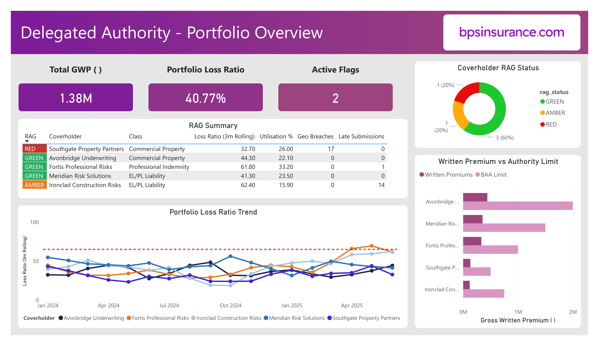
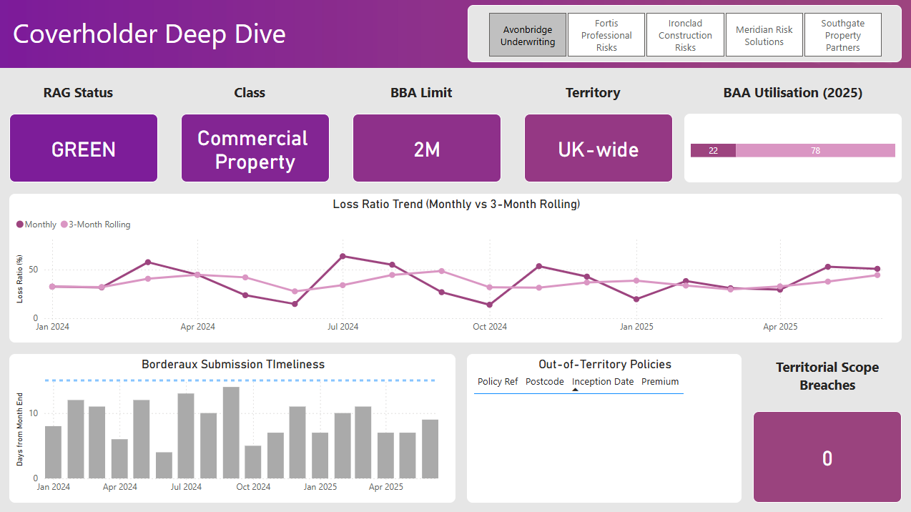
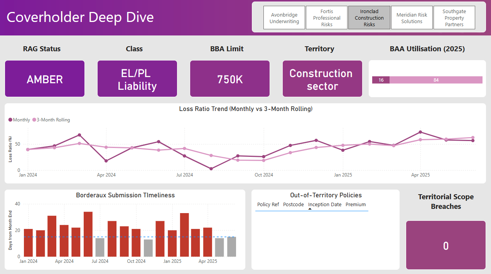
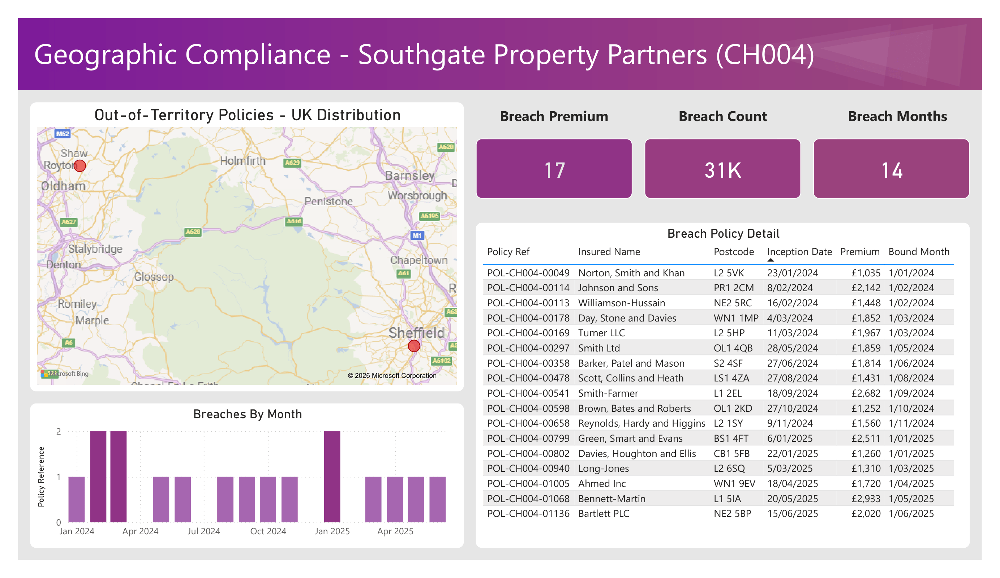

# Delegated-Authority-Performance-Coverholder-Monitoring-System

A data engineering and analytics project replicating the coverholder oversight workflow used by Lloyd's managing agents. Built to demonstrate practical understanding of delegated authority operations, bordereaux analysis, and compliance monitoring in the Lloyd's insurance market.

**Stack:** Python · PostgreSQL · Power BI  
**Data:** Synthetic — 18 months (Jan 2024 – Jun 2025), 5 fictional coverholders  
**Lines of business modelled:** Commercial Property, EL/PL Liability, Professional Indemnity

---

## Background

In the Lloyd's market, managing agents deploy underwriting capacity through **coverholders** — MGAs, brokers, or specialist intermediaries — under **Binding Authority Agreements (BAAs)**. Coverholders can bind risks on behalf of the syndicate without referring each risk to the underwriter individually, subject to strict authority limits and contractual constraints.

The managing agent's Delegated Underwriting (DA) team is responsible for monitoring whether coverholders are operating within those limits. This is done primarily through **bordereaux** — monthly data submissions from each coverholder listing every policy bound and every claim handled under the delegated authority.

Without effective bordereaux monitoring, a managing agent can accumulate unexpected exposures, suffer regulatory breaches, and experience deteriorating loss ratios that are only identified too late to remediate.

This project automates the core monitoring workflow: ingesting bordereaux data, calculating key metrics, flagging compliance and performance issues, and surfacing everything in a management dashboard.

---

## Dashboard

Built in Power BI Desktop, connected directly to the PostgreSQL analytical views. Three pages, each designed for a different audience and level of detail.

### Page 1 — Portfolio Overview

The management summary. Designed to answer "is anything on fire?" in 30 seconds. KPI cards show total written premium YTD, portfolio loss ratio, active flag count, and a RAG distribution donut. The RAG summary table lists all five coverholders sorted by severity with conditional formatting across every metric. The portfolio loss ratio trend shows all coverholders on a single axis with a 65% threshold reference line, immediately surfacing CH003's deterioration. A written premium vs. authority limit bar chart shows each coverholder's headroom against their BAA limit.



### Page 2 — Coverholder Deep Dive

Slicer-driven single coverholder view for quarterly review preparation. Selecting a coverholder updates all panels: RAG status badge, BAA parameters (class, territory, authority limit), utilisation bar, 18-month loss ratio trend (monthly vs. 3-month rolling with 65% threshold), bordereaux submission timeliness (bars coloured red when exceeding the 15-day SLA), and geographic compliance status with breach detail table.



The diagnostic value is in the contrast. A healthy coverholder (CH001 Avonbridge) shows stable loss ratios, all grey timeliness bars, and zero breaches. A problem coverholder (CH005 Ironclad) shows a rising loss ratio, a wall of red timeliness bars, and an AMBER RAG status.



### Page 3 — Geographic Breach Analysis

A dedicated drill-down into the most serious compliance finding: CH004 Southgate Property Partners binding 17 policies outside their South East England territorial restriction. A map plots every out-of-territory policy across the UK, with breach clusters visible in Liverpool, Manchester, Newcastle, Leeds, Sheffield, Bristol, and Cambridge. KPI cards quantify the exposure: 17 breach policies, £30,796 premium at risk, breaches occurring in 14 of 18 months. The breach detail table provides the policy-level remediation list.



---

## Project Structure

```
da-monitoring/
├── data/
│   └── generated/                  # Synthetic CSVs produced by generate_data.py
│       ├── premium_bordereaux.csv
│       ├── claims_bordereaux.csv
│       └── monthly_submissions.csv
├── sql/
│   ├── schema.sql                  # Full database schema
│   └── views/
│       ├── vw_monthly_loss_ratios.sql
│       ├── vw_authority_utilisation.sql
│       ├── vw_geographic_compliance.sql
│       ├── vw_submission_timeliness.sql
│       └── vw_coverholder_scorecard.sql
├── src/
│   ├── generate_data.py            # Synthetic data generation
│   ├── load_data.py                # PostgreSQL ingestion pipeline
│   ├── monitoring_engine.py        # Automated flagging logic
│   └── run_monitoring.py           # Entry point — runs full monitoring cycle
├── powerbi/
│   └── dashboard_screenshots/      # Exported dashboard visuals
├── README.md
└── requirements.txt
```

---

## Coverholder Universe

Five fictional coverholders, each operating under a Binding Authority Agreement with different class, territory, and authority limit parameters.

| ID | Name | Class of Business | Territory | Authority Limit |
|---|---|---|---|---|
| CH001 | Avonbridge Underwriting | Commercial Property | UK-wide | £2,000,000 |
| CH002 | Meridian Risk Solutions | EL/PL Liability | UK-wide SMEs | £1,500,000 |
| CH003 | Fortis Professional Risks | Professional Indemnity | UK-wide | £1,000,000 |
| CH004 | Southgate Property Partners | Commercial Property | South East only | £500,000 |
| CH005 | Ironclad Construction Risks | EL/PL Liability | Construction sector | £750,000 |

Each coverholder submits a **premium bordereaux** and a **claims bordereaux** monthly, along with a submission date. The managing agent has a 15 business day SLA for receipt.

---

## Data Model

### `coverholders`
Reference table. One row per coverholder. Includes authority limit, class of business, geographic scope, and BAA start date.

### `premium_bordereaux`
One row per policy bound. Key fields: policy reference, coverholder ID, inception/expiry date, class of business, premium, sum insured, postcode, underwriting year.

### `claims_bordereaux`
One row per claim. Linked to policies via policy reference. Key fields: claim reference, date of loss, date reported, reserve amount, paid amount, claim status.

### `monthly_submissions`
One row per coverholder per month. Records the submission date for that month's bordereaux and calculates days from month end.

### `flags_log`
Written to by the monitoring engine each run. Stores all active flags with severity, type, coverholder, and detail.

---

## Monitoring Logic

The `monitoring_engine.py` script connects to PostgreSQL, queries the analytical views, and produces a structured flag report. Five checks are run:

**Loss Ratio Deterioration**  
Flags any coverholder where the 3-month rolling loss ratio exceeds 65%, or where it has increased by more than 15 percentage points over the prior 3-month period. Severity: High above 75%, Medium above 65%.

**Authority Limit Utilisation**  
Calculates cumulative written premium per coverholder per underwriting year as a percentage of their BAA authority limit. Warning at 80%, breach alert at 95%.

**Geographic Compliance**  
For coverholders with territorial restrictions, checks whether any bound policy has a postcode outside the permitted area. Every breach is flagged as High severity — this is a potential unintended exposure and a regulatory issue.

**Bordereaux Submission Timeliness**  
Calculates days between month end and submission date. Flags anything over 15 business days. Persistent lateness (3+ consecutive months) is escalated to High severity.

**Composite RAG Status**  
The `vw_coverholder_scorecard` view aggregates all active flags into a single RAG (Red/Amber/Green) status per coverholder, used as the top-level management indicator.

---

## Key Findings (Synthetic Data)

Running the monitoring engine against the generated dataset surfaces the following issues:

**CH004 — Southgate Property Partners: Geographic Scope Breach (HIGH)**  
17 policies identified with postcodes outside the South East England territory defined in the BAA. Affected postcodes span Liverpool (L1, L2), Manchester area (OL1, WN1, PR1), Newcastle (NE2), Leeds (LS1), Sheffield (S2), Bristol (BS1), and Cambridge (CB1) — representing £30,796 of premium at risk. Breaches occur in 14 of 18 months, indicating a systemic process failure rather than an isolated incident. These risks represent both an unintended exposure and a compliance issue requiring immediate remediation.

**CH003 — Fortis Professional Risks: Loss Ratio Deterioration (HIGH)**  
Loss ratio stable in the low 30s through the first 14 months, then spikes sharply with monthly figures of 85.6% and 86.4% in March–April 2025. The 3-month rolling average crosses the 65% threshold in April 2025 (65.9%) and remains elevated at 69.5% and 61.8% through June 2025. Recommended action: request a claims review and consider suspending new business pending investigation.

**CH005 — Ironclad Construction Risks: Submission Timeliness (HIGH)**  
Bordereaux submitted late in 14 of 18 months, with delays ranging from 20 to 34 days against the 15 business day SLA. Average delay on late submissions is 24 days. The persistence and severity of the lateness — including a 34-day delay in June 2024 — indicates a systemic operational issue. Recommended action: formal remediation notice per BAA terms, with consideration of BAA suspension if the pattern continues.

**CH005 — Ironclad Construction Risks: Loss Ratio Approaching Threshold (MEDIUM)**  
The 3-month rolling loss ratio climbs steadily through Q1–Q2 2025, reaching 58.3%, 59.3%, and 62.4% in the final three months. While not yet breaching the 65% threshold, the trajectory warrants close monitoring. Combined with the submission timeliness issues, this coverholder presents a compound risk that may require intervention before the loss ratio formally triggers.

---

## Setup & Replication

### Requirements

```bash
pip install -r requirements.txt
```

Contents of `requirements.txt`:
```
pandas
numpy
faker
psycopg2-binary
sqlalchemy
```

### Database

Create the database in PostgreSQL:

```sql
CREATE DATABASE da_monitoring;
```

Run the schema:

```bash
psql -d da_monitoring -f sql/schema.sql
```

### Generate Data

```bash
python src/generate_data.py
```

Outputs CSVs to `data/generated/`.

### Load Data

```bash
python src/load_data.py
```

Connects to `da_monitoring` and loads all three CSVs. Update the connection string in `load_data.py` if your PostgreSQL credentials differ from the defaults.

### Run Monitoring Engine

```bash
python src/run_monitoring.py
```

Runs all five checks, prints a flag summary to console, and writes results to the `flags_log` table.

### Power BI

Open Power BI Desktop, connect via Get Data → PostgreSQL, point to `localhost/da_monitoring`, and import the five views. The report file is not included in the repo due to size, but dashboard screenshots are available in `powerbi/dashboard_screenshots/`.

---

## Insurance Market Context

**Delegated authority** is a core feature of the Lloyd's and London Market, enabling capacity to be deployed at scale through specialist intermediaries. The Lloyd's market writes approximately £40bn of gross written premium annually, a significant portion of which flows through binding authorities.

Key regulatory context: Lloyd's requires managing agents to maintain robust oversight of their coverholders under the Lloyd's Delegated Underwriting Byelaw and the Coverholder Reporting Standards (CRS). The types of monitoring implemented in this project — loss ratio tracking, authority utilisation, geographic compliance, and submission timeliness — directly mirror the requirements set out in those standards.

**Bordereaux quality** is one of the most operationally challenging aspects of DA oversight. Data arrives in inconsistent formats, coverholders interpret field definitions differently, and late submissions create blind spots in the managing agent's exposure position. A recurring theme in Lloyd's market modernisation efforts (including the Blueprint Two programme) is improving the digitisation and standardisation of bordereaux data flows.

---

## About

Built as a portfolio project to demonstrate practical understanding of Lloyd's delegated authority operations and the analytical workflow of a managing agent's DA team. The dataset is entirely synthetic; any resemblance to real coverholders or managing agents is coincidental.
